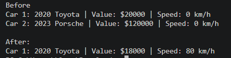
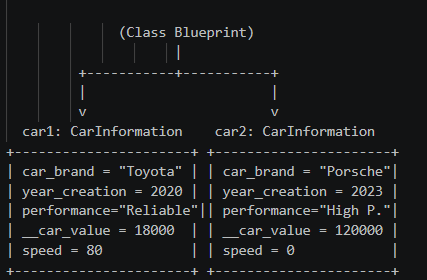

# Class Attributes and Methods

## Previous Design
Link to my previous activity:  
[classObjectUML.md](classObjectUML.md)

---

## Design Revision
 
Refined property names to standard Python (`carBrand`, `yearCreation`, `carValue`, `performance`). Added `speed` to track driving state and turned `carValue` as a private attribute.

---

## Visibility Decisions

| Attribute:     | Data Type:| Visibility:| Reason:                                                                    |
| `carBrand`     | `string`  | Public     | General brand information open to access.                                  |
| `yearCreation` | `integer` | Public     | Fixed manufacturing year metadata.                                         |
| `performance`  | `string`  | Public     | Descriptive performance rating.                                            |
| `carValue`     | `integer` | Private    | Sensitive financial value protected from direct modification.              |

## Updated UML Class Diagram
[Class Diagram](images/classDiagramSG5.png)

## Python Implementation
[View Python Source](classImplementation.py)

## Test Run

## Object Diagram

---

### Analysis:

## Why did you make your chosen attribute private?
The carValue attribute was made private (__carValue) to prevent accidental or invalid direct changes from outside the class. Keeping it private ensures monetary amounts are modified safely using controlled methods like set_value().  

## Which method changes the state of your object?
The drive() method alters the object's state by updating speed, while set_value() modifies the private __car_value attribute. Both methods validate input parameters before updating the internal variables.  

## How did your two objects demonstrate that instances are independent?
When methods were called on car1, its speed updated to 80 km/h and value changed to $18,000, while car2 retained its original values (0 km/h and $120,000). This proves each instance maintains its own separate memory space.  

## What is the difference between your class diagram and your object diagram?
The class diagram shows the static structure and design blueprint containing data types and signatures. The object diagram captures a specific runtime snapshot showing actual assigned values for each created instance[cite: 2].  
